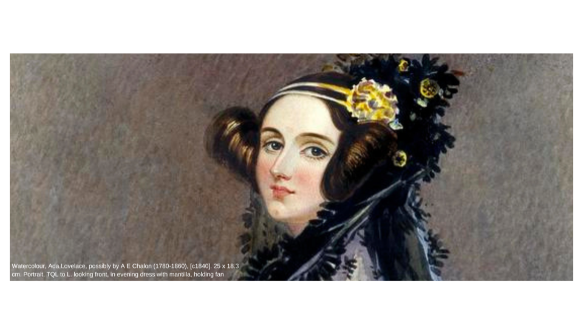
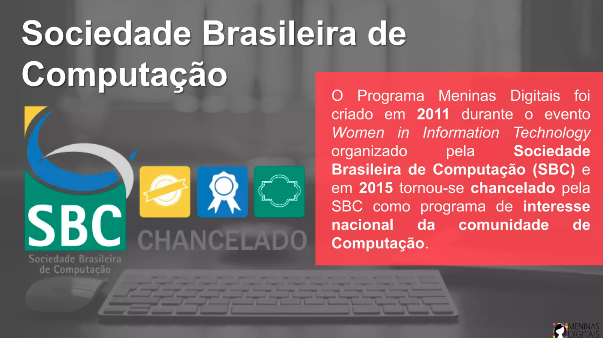

{::nomarkdown}
template: inverse

# Motivação



---
# Motivação

“Em 1995, 37% dos cientistas da computação eram mulheres. Hoje, são apenas 24%. A porcentagem continuará diminuindo se não fizermos nada. Sabemos que a maior queda de meninas na ciência da computação é entre 13 e 17 anos.“ 

(https://girlswhocode.com/about-us)

---
# UNESCO Science Report 2021 

"As mulheres ainda estão sub-representadas nas áreas de Computação, Engenharias, Matemática e Física. 
Segundo o relatório, 
- as mulheres representam apenas 28% dos graduados em Engenharia e deste subgrupo, 
   - 40% são graduados em Ciência da Computação – área fundamental para o desenvolvimento de habilidades consideradas vitais para os empregos do futuro."

---
# Cargos técnicos e de liderança

- Na área tecnológica de inteligência artificial (IA), as mulheres representam apenas 22% da força de trabalho.
- Na área de computação em nuvem, as mulheres representam 14% das pessoas que trabalham em tais cargos.

---

# Na Bahia

- Documento Curricular Referencial da Bahia (DCRB) para o Ensino Médio:

   - "Em 2020, do total de 557.441 matriculados, 300.916 eram do sexo feminino (53,98%) e 256.525 (46,02%), do sexo masculino."

- UFBA: Em geral, 10 mulheres ingressam  no curso de Ciência da Computação por ano (Pouco mais de 10%)

---

---

---
# Valores

- Diversidade: Meninas trazem diferentes habilidades, culturas, identidades e opiniões que resultam em organizações mais fortes.

- Ativismo: Meninas devem ser preparadas não apenas para ampliar a força de trabalho na TI, mas para liderar, melhorar, e transformar as organizações.

- Solidariedade: Meninas devem ser preparadas para debater questões de gênero e problemas enfrentados por mulheres (por exemplo, meritocracia misógina e ocorrências de assédio moral e sexual) e estimuladas a participar de comunidades de mulheres para alcançar objetivos em comum.

---
template: inverse

# Apresentação do curso

---
# Objetivos

Reunir pessoas, meninas, mulheres para:

- Escrever pequenos programas de computador
- Resolver problemas através programas (raciocínio computacional)
- Divertir-se enquanto programam.

---

# Por que aprender a programar?

- Automatizar tarefas
- Gerenciar informação
- Para participar ativamente da Sociedade da Informação

> Porque é divertido.
---

# Pra que aprender a programar?

- Se existe um programa pronto, eu posso usá-lo
- Se existe um programa parecido, talvez eu possa modificá-lo
- Se não existe, posso criá-lo (programá-lo)

---

# Automatizar tarefas

- Renomear arquivos de foto para ficar no padrão ano-mês-dia
- Internet das coisas; automação residencial
- Jornalismo de dados
- Carros autônomos

---

# Gerenciar informação

- Sistemas de informação em geral (gerenciador de eventos, lojas virtuais etc.)
- Aplicativos móveis

---

# Metodologia

- Uso da linguagem de programação Python
- Exercícios com correção automática
- Aulas práticas e teóricas

---

# Leituras

- Allen B. Downey.  (2ª ed.). Disponível em https://penseallen.github.io/PensePython2e/
- Allen B. Downey.  (3ª ed.). Disponível em https://panda.ime.usp.br/pensepy/static/pensepy/

{:/}
