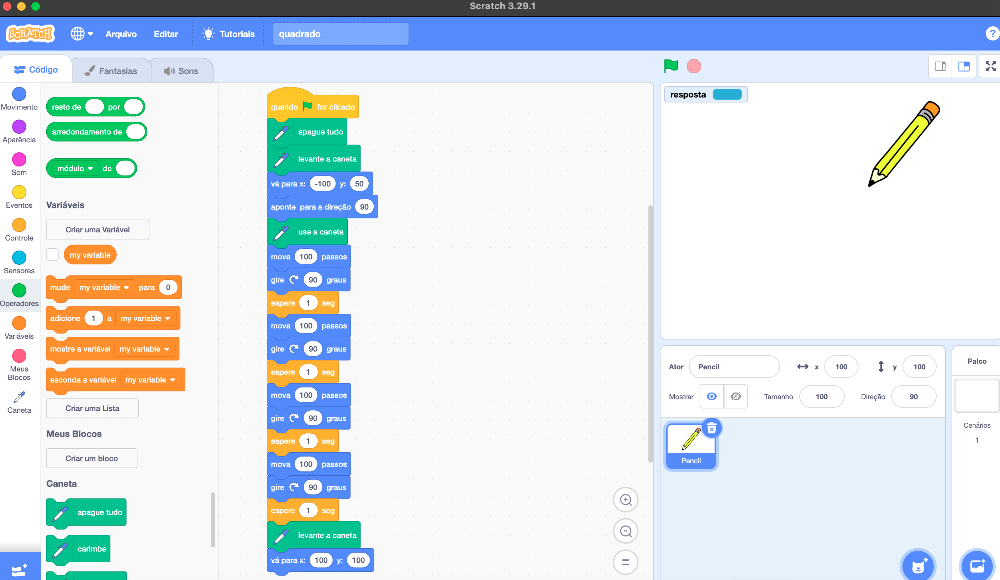
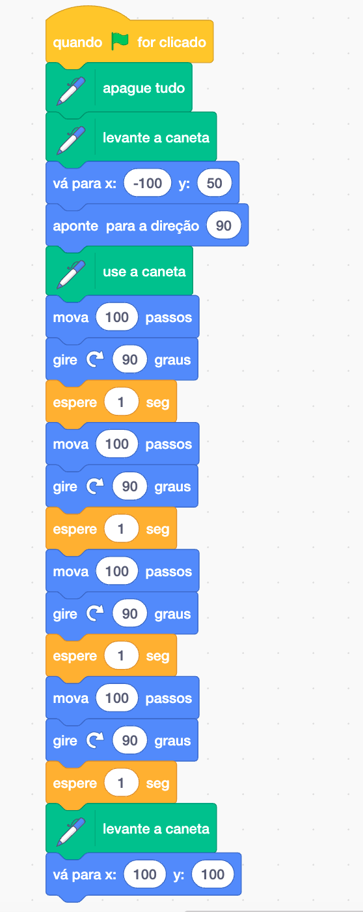
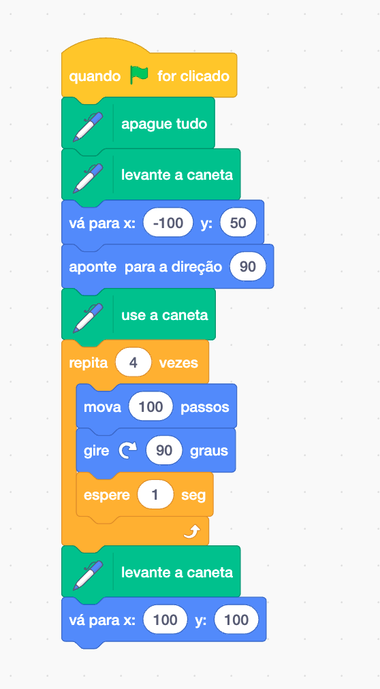

{::nomarkdown}
template: inverse

# Exemplos



---

# Desenhar quadrado

- 4 lados, todos com mesmo comprimento
- Ângulos internos: 90 graus


## Algoritmo


---

# Scratch IDE



---

# Desenhar Quadrado (1)



---

# Desenhar Quadrado (2)




---

# Desenhar Quadrado com Turtle (1)

```python
from turtle import *

home()
setx(-100)
sety(50)
clearscreen()
right(90)
forward(100)
right(90)
forward(100)
right(90)
forward(100)
right(90)
forward(100)
x = input()
```

---

# Desenhar Quadrado com Turtle (2)

```python
from turtle import *

home()
setx(-100)
sety(50)
clearscreen()
for i in range(4):
   right(90)
   forward(100)
x = input()
```

{:/}
