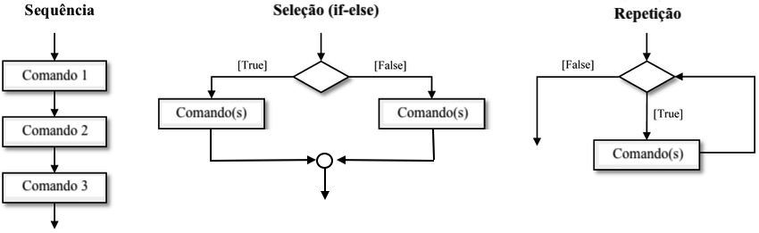
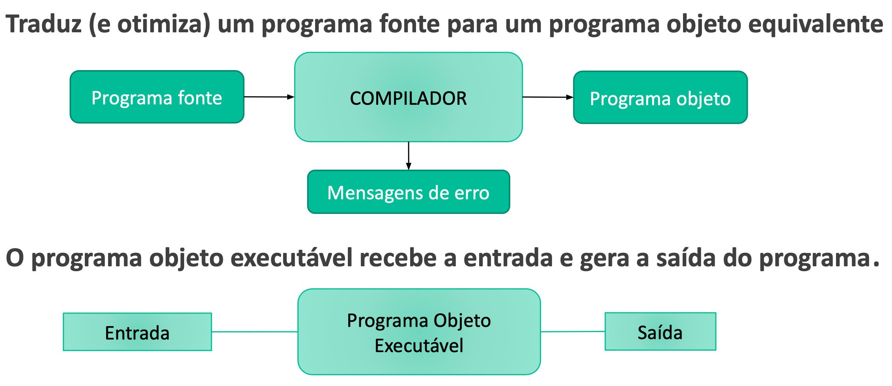
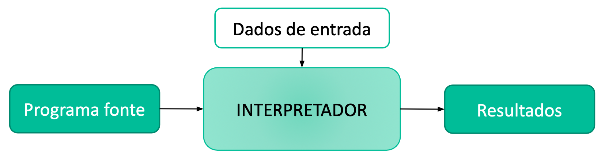

{::nomarkdown}
template: inverse

# Algoritmos e Programas



---

# Algoritmo

Um **algoritmo** é uma sequência de passos bem definidos para resolver um problema. 

### Exemplos

- Receita de bolo
- Manual de produto
- Processo de matrícula

<!-- Algoritmos devem ser expressos dentro de uma quantidade **finita** de espaço e tempo. -->

<!-- Na computação, algoritmos transformam valores de entrada em valores de saída (como funções). -->

---
# Troca de Pneu Furado

```
Pare em um local seguro. 
Pegue o triângulo e sinalize atrás do veículo.
Localize o estepe, macaco e chave de roda. 
Afrouxe os parafusos do pneu furado com a chave de roda.
Levante o veículo com o macaco.
Solte os parafusos.
Troque o pneu furado pelo estepe.
Aperte os parafusos com a chave de roda.
Desça o carro.
Guarde o triângulo, estepe, macaco e chave de roda.
```
---

# Programa

Um **programa** é uma sequência de instruções que serão executadas pelo computador. 
Programas descrevem e implementam algoritmos.

O computador consegue executar **código de máquina**, isto é, programas escritos em **linguagem de máquina**. <!-- Cada máquina entende uma linguagem diferente -->

Pessoas geralmente trabalham com **código-fonte**, isto é, programas escritos em uma **linguagem de programação de alto nível** (mais fácil de entender).

> Exemplos de linguagens de programação: C++, Python, Java, JavaScript

---

# Instruções

As linguagens de programação possuem instruções para:

- **entrada de dados** - ler dados do teclado, de um arquivo, da rede, do relógio, da câmera e outros dispositivos
- **saída de dados** - escrever na tela ou em um arquivo, enviar dados via rede, emitir um som etc.
- **processamento de dados** - transformar dados, por exemplo, com operações aritméticas e estruturas para controlar o fluxo de execução:
   - **sequência**
   - **seleção** 
   - **repetição**

---

# Estruturas de Controle



---

# Exemplo de algoritmo

Algoritmo para calcular a idade de uma pessoa, escrito em português:

1. Pergunta o ano atual
2. Pergunta o ano de nascimento de uma pessoa
3. Pergunta se a pessoa já fez aniversário no ano atual
4. Calcula a idade (ano atual menos ano de nascimento)
5. Se a pessoa ainda não fez aniversário, subtrai 1 da idade
6. Diz a idade, ou seja, o resultado do cálculo

---

# Exemplo de programa

Código-fonte do programa na linguagem de programação Python:

```python
# Entrada
ano_atual = int(input())
ano_nascimento = int(input())
ja_fez_aniversario = input() == "sim"

# Processamento
idade = ano_atual - ano_nascimento
if not ja_fez_aniversario:
    idade = idade - 1

# Saída
print(idade)
```
---

# Tradução e execução de programas

O computador consegue executar **código de máquina**, isto é, programas escritos em **linguagem de máquina**. <!-- Cada máquina entende uma linguagem diferente -->

- É preciso traduzir um programa escrito em *linguagem de programação* para um programa em *linguagem de máquina*.

Um **compilador** é um programa que traduz o código-fonte de um programa escrito 
em uma linguagem de programação para  código de máquina.

- O compilador traduz todo o programa e grava o código de máquina em um arquivo executável.

Um **intepretador** também é um programa que traduz o código-fonte em código de máquina, mas executa as instruções à medida em que faz a tradução.

- Um programa que é interpretado também é chamado de **script**.

---

# Compilador



---

# Interpretador




{:/}
