{::nomarkdown}
template: inverse

# Entrada e saída para Correção Automática



---

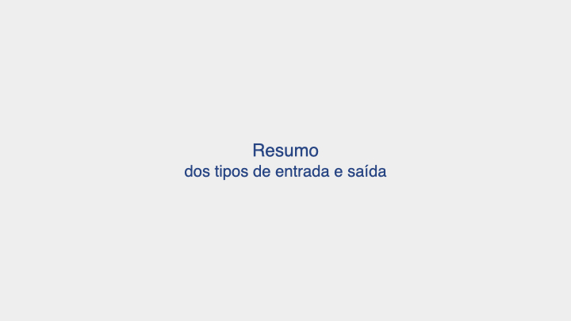

---

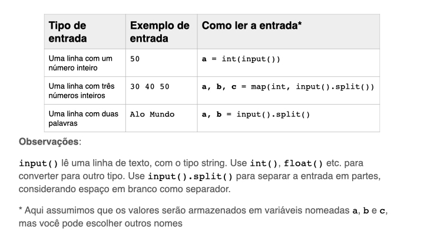

---

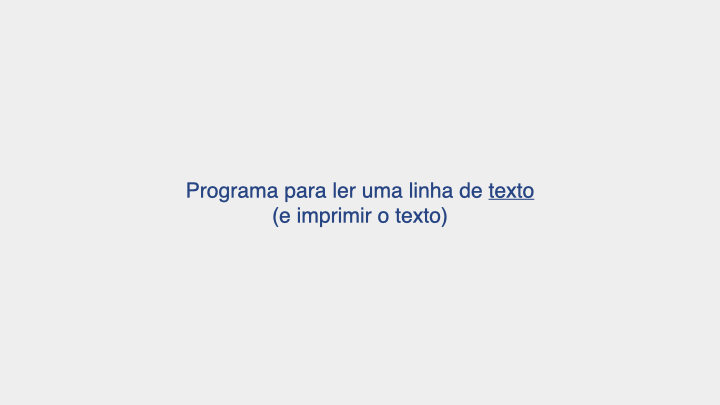

---

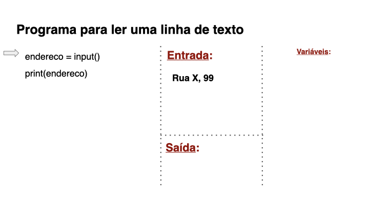

---

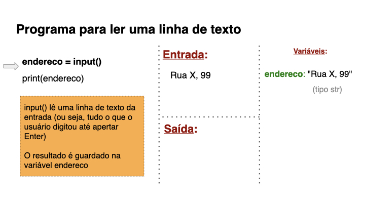

---

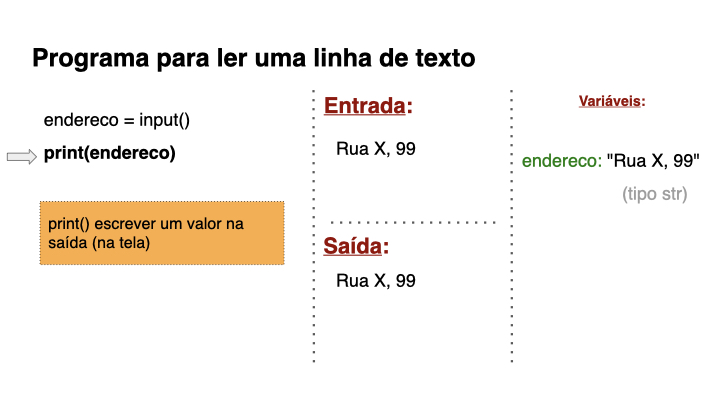

---

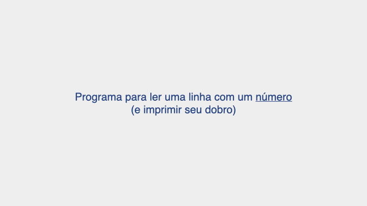

---

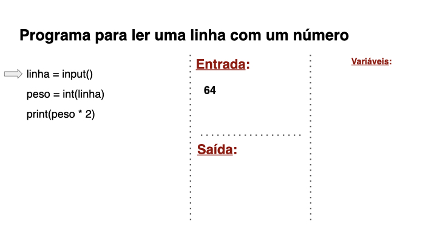

---

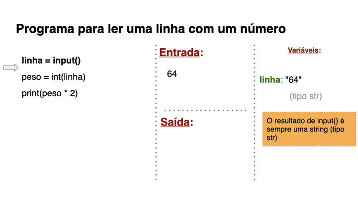

---

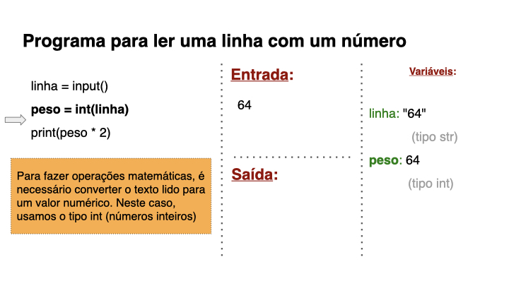

---

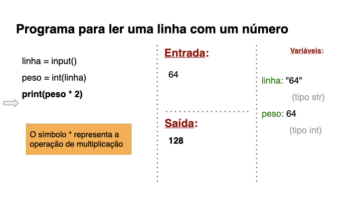

---

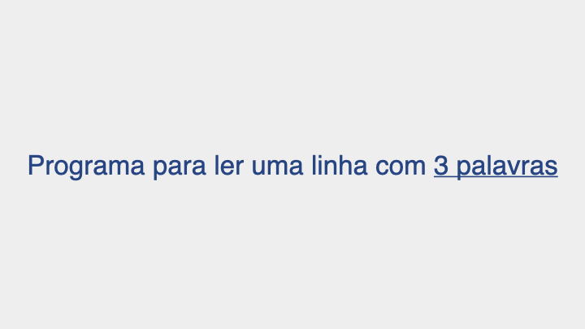

---

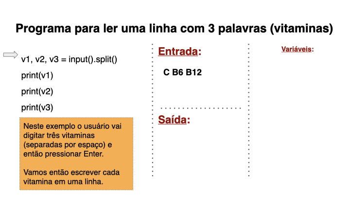

---

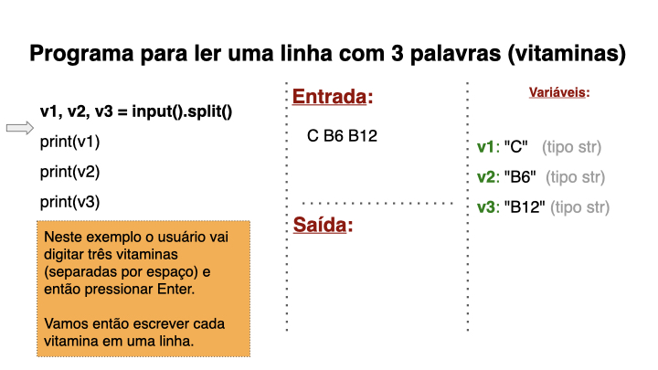

---

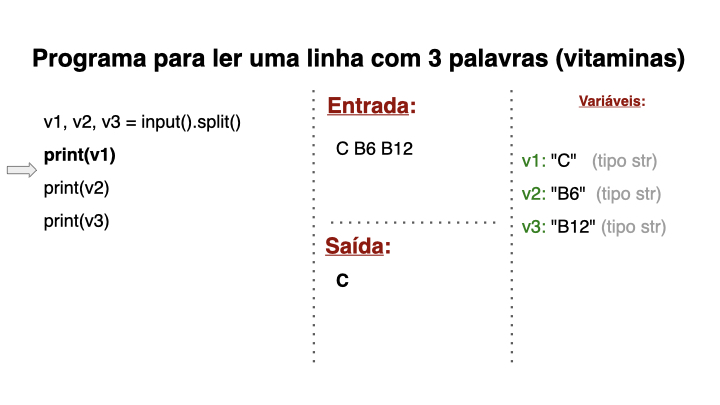

---

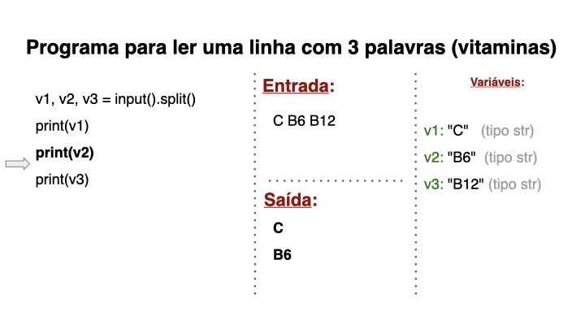

---

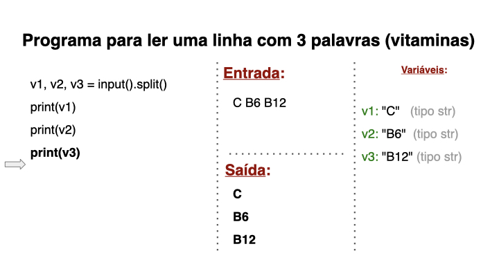

---

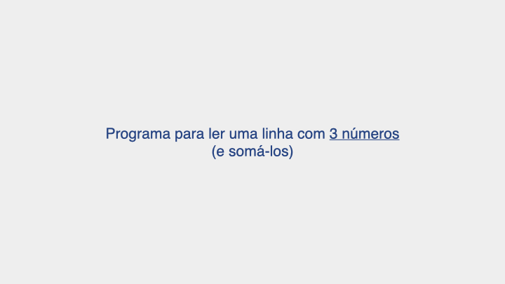

---

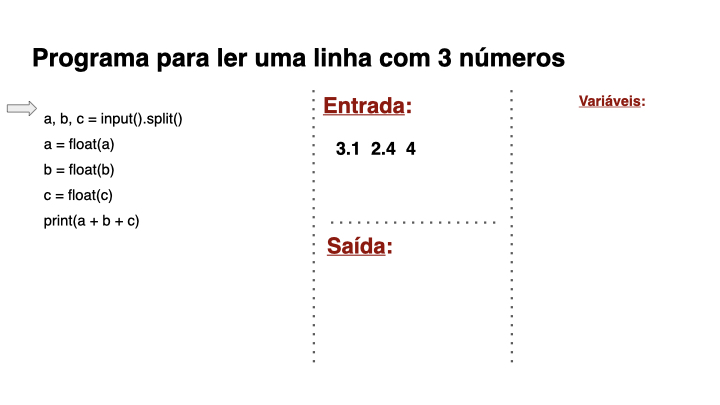

---

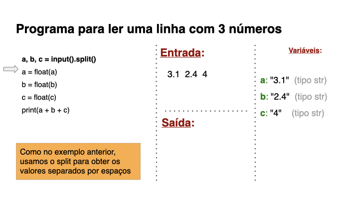

---

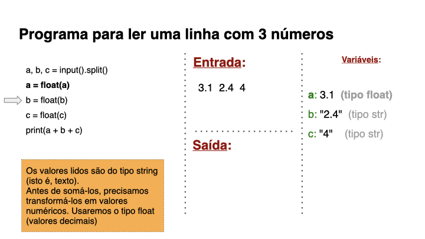

---

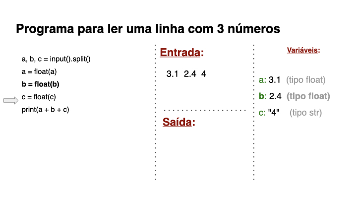

---

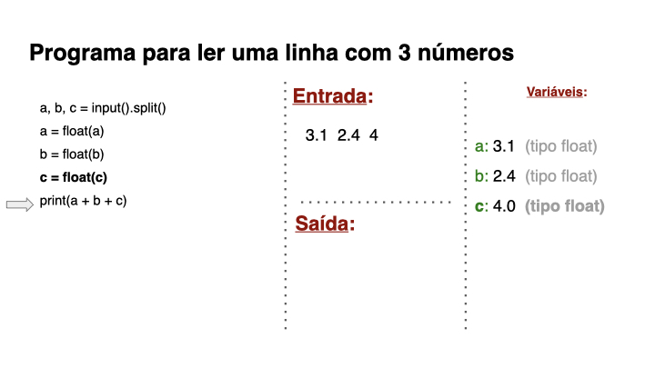

---

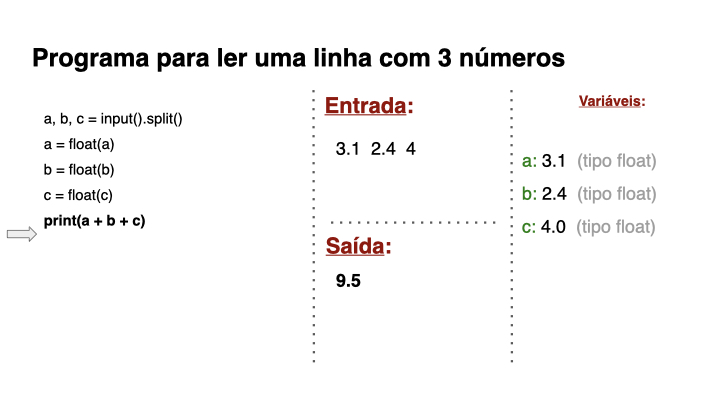

---

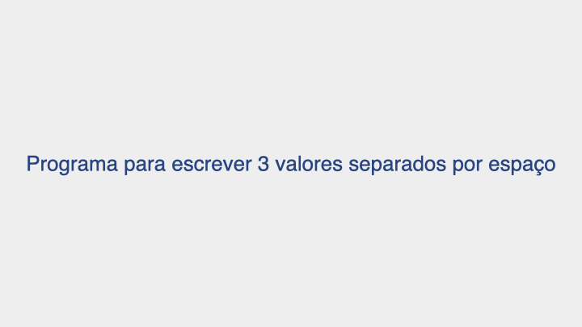

---

---

---

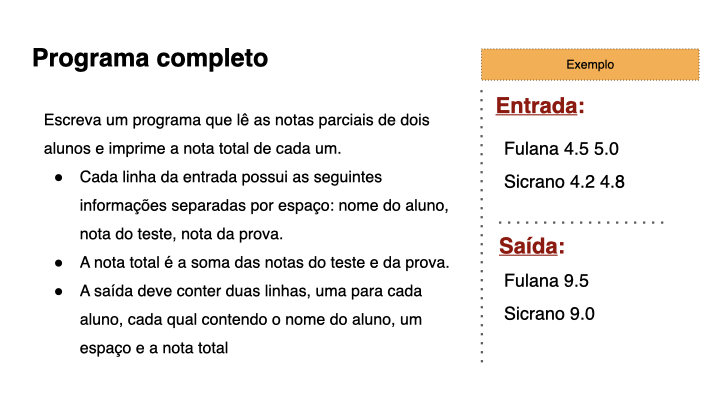

---

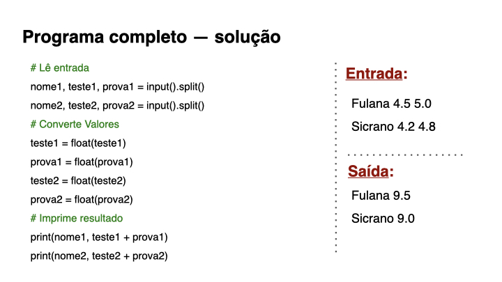

{:/}
