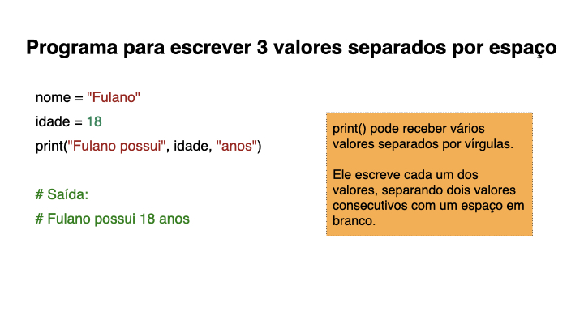
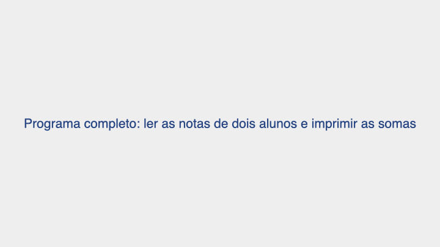

{::nomarkdown}
template: inverse

# Entrada e saída para Correção Automática



---

---

---

---

---

---

---

---

---

---

---

---

---

---

---

---

---

---

---

---

---

---

---

---

---

---

---

---

---

{:/}
