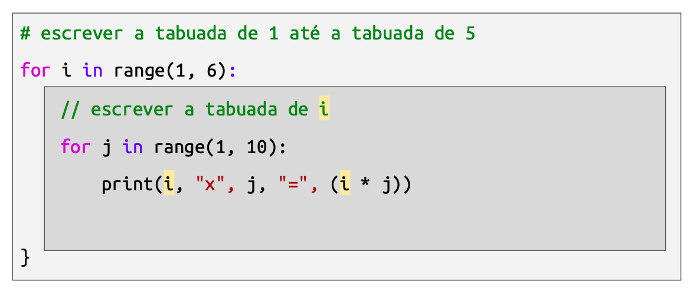

{::nomarkdown}
template: inverse

# Estruturas de Repetição 



# Motivação

## Estrutura `for`

- A estrutura for permite executar um bloco de código determinado número de vezes.
- A variável de controle controla quantas vezes o código já executou

```python
for i in range(5):
    bloco de instruções...
variável de controle
qtd de repetições
```
---

Exemplo: programa que cumprimenta duas pessoas (sem for)

```python
print("Qual seu nome?")
nome = input()
print("Olá,", nome)

print("Qual seu nome?")
nome = input()
print("Olá,", nome)
```

---
Exemplo: programa que cumprimenta duas pessoas (com for)

```python
for i in range(2):
print("Qual seu nome?")
nome = input()
print("Olá,", nome)
```
---


Exemplo: programa que cumprimenta N pessoas (usando for)

```python
print("Quantas pessoas?")
n = int(input())

for i in range(n):
    print("Qual seu nome?")
    nome = input()
    print("Olá,", nome)
```

---

# Estrutura for

- range(n) gera a sequência de números 0, 1, 2, …, n - 1

A cada repetição, a variável de controle assume o próximo valor da sequência

```python
for i in range(5):
    bloco de instruções...
```

variável de controle

sequência 0, 1, 2, 3, 4

Exemplo: imprimir números de 0 a 4

```python
for i in range(5):
  print(i)
```

Exemplo: imprimir números de 1 a 5

```python
for i in range(5):
  print(i+1)
```

Exemplo: programa que imprime a tabuada de 9

```python
for i in range(10):
  print(f"9 * {i} = {9 * i}")
```

## range
A função range gera uma sequência de números.

Até agora vimos que range(n) gera a sequência 0, 1, 2, …, n - 1
A forma mais completa é:

```python
   range(inicio, fim, passo)      #(passo é opcional; se não for informado, é 1)
```

que gera uma sequência do número inicio até o número fim (não incluso), contando de passo em passo.


## range
Exemplos:

```python
range(1, 5)  gera 1, 2, 3, 4

range(5, 1, -1) gera 5, 4, 3, 2    (passo negativo)

range(0, 10, 2)  gera 0, 2, 4, 6, 8   (de 2 em 2)

range(0, 9, 3) gera 0, 3, 6
```

## Exercício

Crie um programa para escrever a seguinte letra de música:
1 elefante incomoda muita gente

2 elefantes incomodam, incomodam muito mais

3 elefantes incomodam muita gente

4 elefantes incomodam, incomodam, incomodam, incomodam muito mais

e assim por diante, até chegar a 10 elefantes

## Exercícios

# Estrutura `while`

## Pavê de chocolate. 
### Modo de preparo:
- Em um liquidificador, bata o creme de leite com o achocolatado;
- Em um refratário, adicione uma camada do creme de chocolate;
- Adicione uma camada de biscoito;
- Repita enquanto houver ingredientes;
- Guarde na geladeira por 3 a 4 horas para endurecer;
- Sirva.

Considere a seguinte receita
(Adaptado de https://gshow.globo.com/RPC/Estudio-C/cozinha-paranaense/receitas/receitas-faceis-3-sobremesas-com-3-ingredientes.ghtml)

A receita é uma lista de instruções, que devem ser executadas na sequência, de cima para baixo
Existem instruções especiais, que orientam o leitor a repetir outras instruções: “faça isso até”; “repita enquanto”

Informalidade da linguagem: na instrução 4, quais instruções devem ser repetidas?
A instrução 4 cria um ciclo (loop) na execução do programa. 
P: desenhar ciclo; escrever a palavra LOOP


`While` significa enquanto. “Enquanto a condição for verdadeira, execute as seguintes instruções”.

```python
  while condição:
    instruções...
```

As estruturas de repetição também são chamadas de laços ou loops

# Estrutura while

`While` funciona como um `if`, sendo que no final do bloco de instruções o programa “pula” para o início da estrutura
P: rabiscar sequência de execução

```python
i = 1
while i <= 3:
  print(i)
  i = i + 1
print("Fim")
```

Exemplo: imprimir de 1 a 3 e imprimir “Fim”

Variáveis:                                               Saída:

P: circular estrutura while. Perguntar: qual é a condição? Circular condição. Qual é o bloco de instruções que será repetido? Circular bloco.

Essa instrução “variável recebe valor da variável mais um” é tão comum os programadores criaram uma forma abreviada de escrevê-la: “variável mais mais”. P: rabiscar


# Elementos de um loop

```python
i = 1               // 1. inicialização da variável de controle
while i <= 3:       // 2. teste da condição
  print(i)          // 3. instruções a serem repetidas
  i = i + 1         // 4. atualização da variável de controle
```


Você não pode simplesmente escrever uma estrutura de loop
P: circular ocorrências da variável “i”
A variável de controle, nesse caso, também é chamada de “contador” (pois é uma variável numérica que está incrementando ou decrementando)

```python
i = 1
while i <= 3:
  print(i)
```

### Encontre o erro

Encontre o erro!
- O que está faltando nesse programa?
- O que vai acontecer se você executar esse programa?

P: escrever LOOP INFINITO
O programa é equivalente a while (true) { cout << 3 << endl; }

### Encontre o erro

```python
while i <= 3:
  i = 1
  print(i)
  i = i + 1
print("Fim")
```

### Encontre o erro
- O que está errado nesse programa?
- O que vai acontecer se você executar esse programa?

P: escrever LOOP INFINITO

```python
i = 3
while i >= 8:
  print(i)
  i = i + 1

print("Fim")
```

## Encontre o erro (programa para contar de 3 a 8)

Encontre o erro!
Inversão do operador relacional. O loop não executa

## Exercícios

Usando estruturas de repetição, crie um programa para...
- Escrever “Eu sei programar” 5 vezes
- Escrever a sequência 0, 2, 4, 6, 8, 10
- Escrever a sequência 9, 6, 3, 0, -3, -6, -9
- Escrever a sequência 1, 2, 4, 8, 16, 32, 64
- Escrever a sequência 1, 2, 3, 4, 1, 2, 3, 4, 1, 2, 3, 4
- Escrever a sequência 1, 2, 3, 4, 4, 3, 2, 1
- Escrever 5 vezes: note que nesse caso o bloco de instruções não referencia a variável de controle

Usando estruturas de repetição, crie um programa para...
- Ler números enquanto eles formarem uma sequência crescente; parar quando for digitado um número igual ou menor que o anterior
- Jogar “adivinhe o número”: o programa possui um número secreto, entre 0 e 100. O jogador deve tentar adivinhar o número sucessivamente, até acertar. Para cada tentativa, o programa deve informar se o número secreto é maior ou menor do que o número informado.

# Exercícios

## Dicas para problemas de correção automática

- Muitos problemas têm como entrada uma lista de números
- Há duas formas principais de entrada nesse caso:
   - O primeiro valor indica quantos números serão fornecidos na entrada
   - É usado um valor especial para indicar o final da entrada

### Indicação da quantidade de números da entrada

```python
n = int(input())

for i in range(n):
   x = int(input())
   print(x * 2)
```

### Entrada
### Saída
2

2

3

4

6

3

1

5

3

2

10

6

## Programa dobro

Dada uma lista de N inteiros, imprima o dobro de cada número.

### Entrada
A entrada é composta de várias linhas, cada um com um número. O primeiro número é um inteiro positivo N. Os N números seguintes são valores inteiros X para os quais se deve calcular o dobro.

### Saída
Seu programa deve produzir N linhas na saída, contendo o dobro de cada um dos N números.

Não precisa ler toda a entrada antes de imprimir a saída. Pode-se intercalar ler e escrever.

## Valor especial (sentinela) indicando fim da entrada

```python
x = int(input())
while x != 0:
   print(x * 2)
   x = int(input())
``` 

Dada uma sequência de números inteiros, imprima o dobro de cada número.

### Entrada

A entrada é composta de várias linhas, cada uma com um número da sequência. O número 0 representa o final da entrada; isto é, ele não faz parte da sequência e, ao ler esse valor, seu programa deve encerrar.

### Saída

Para cada linha da entrada (exceto o 0), seu programa deve imprimir uma linha com o dobro do número lido.
Entrada

### Saída
1
2
3
0
2
4
6
2
-1
0
4
-2
cin >> i, i != 0

### Acessando cada valor em uma linha com vários valores
Escreva um programa que lê uma frase e imprime cada palavra dessa frase em uma linha

`input().split()` retorna uma lista de strings

Você pode acessar cada string dessa lista usando o for. Veja o exemplo:

### Entrada
### Saída

# Outras instruções: break e continue

As instruções `break` e `continue` permitem alterar o fluxo de execução normal de um loop (seja for ou while)

Observações:
- Em geral é possível escrever programas sem usar essas instruções
- Em geral o seu uso deve ser evitado, pois tende a tornar o código mais difícil de entender (sobretudo em loops com muitas linhas de código)

```python
while True:
   n = int(input())
   if n == 0:
       break
   print(n * 2)
print("Fim")
```

Dentro de qualquer estrutura de repetição, é possível usar a instrução break para sair do loop

# break

Loop infinito. Mostrar também for (;;)

# continue
Dentro de qualquer estrutura de repetição, é possível usar a instrução continue para voltar para o início do loop

# Não imprime os múltiplos de 3
for i in range(1, 10):
   if i % 3 == 0:
       continue
   print(i)

# Tópicos avançados

# Iterações, acumuladores e invariantes de loop

- Conceito: iteração (não confundir com interação)

Cada execução do bloco de código dentro de um loop é chamado de iteração

No exemplo a seguir, responda:
- O loop executa quantas iterações?
- Qual valor é impresso na 2ª iteração?

```python
for i in range(4, 10, 2):
   print(i)
```
# Conceito: invariante de loop

Um invariante de loop é uma condição que é verdadeira para todas as iterações de um loop
No seguinte exemplo, um possível invariante é que cada iteração imprime um único valor entre 4 e 10.

```python
for i in range(4, 10, 2):
   print(i)
```

## Dada uma lista de N inteiros, encontre a soma de todos eles.
### Entrada
A entrada é composta de várias linhas, cada uma com um número. O primeiro número é um inteiro positivo N. Os N números seguintes são valores inteiros X que devem ser somados.

### Saída
Seu programa deve produzir uma única linha na saída, contendo a soma de todos os N inteiros.

# Problema SOMA - adaptado de https://br.spoj.com/problems/SOMA/

Entrada
Saída
2
2
3
5
3
1
5
3
9

# Invariante de loop:

Ao final da i-ésima iteração, a variável soma contém a soma dos primeiros i números.

```python
n = int(input())
soma = 0
for i in range(n):
   x = int(input())
   soma += x
print(soma)
```

# Acumulador

Acumulador é uma variável que guarda o resultado parcial de uma computação, sendo atualizada dentro de um loop com base no seu valor anterior e no valor do item sendo analisado na iteração atual. É o caso da variável soma do exemplo anterior:

Conceito: acumulador

3
4
5
3
7
0
12
soma:
X:
+
+
+

## Dada uma lista de N inteiros não-negativos distintos entre si, encontre o maior de todos eles.

### Entrada
A entrada é composta de vários números em linhas diferentes. O primeiro número é um inteiro positivo N. Os N números seguintes são valores inteiros X a serem analisados.

# Saída
Seu programa deve produzir uma única linha na saída, contendo o maior de todos os N inteiros.

# Problema MÁXIMO - adaptado de https://br.spoj.com/problems/SOMA/
Invariante de loop: Ao final da i-ésima iteração, a variável maior contém o maior dos primeiros i números

```python
n = int(input())
maior = -1
for i in range(n):
   x = int(input())
   maior = max(maior, x)
print(maior)
```

// Alternativa:
```python
if x > maior:
   maior = x
```

Entrada
Saída
2 
2
3
3
3
1
5
3
5

3
8
5
3
8
0
8
maior:
X:
max
max
max

# Loops aninhados

As estruturas de repetição são consideradas instruções.
Isso significa que é possível incluir uma estrutura de repetição dentro de outra.
Isso é o que chamamos de loops aninhados.

## Escrever da tabuada de 1 até a tabuada de 5.

A saída deve obedecer ao seguinte formato:

1 x 1 = 1

1 x 2 = 2

1 x 3 = 3

...

1 x 9 = 9

2 x 1 = 1

2 x 2 = 4

...

5 x 9 = 45

# Exemplo: tabela de multiplicação

- tabuada de 1
- tabuada de 2
- ...
P: circular variáveis


## Pensando “de fora pra dentro”




Escrever a tabuada de 1 até a tabuada de 5

``` python
for i in range(1, 6):
    // escrever a tabuada de i


}

// escrever a tabuada de i
for j in range(1, 10):
    print(i, "x", j, "=", (i * j))
```

Encontre o erro

# escrever a tabuada de 1 até a tabuada de 5

```python
for i in range(1, 6):
    for i in range(1, 10):
        print(i, "x", j, "=", (i * j))
``` 

- Encontre o erro!
segundo loop, está i <= 9 (deveria ser j <= 9)

## Exercício

Leia dois números inteiros, L e C, e imprima um retângulo composto apenas de caracteres #, com L linhas e C colunas.

Exemplo:
Entrada
Saída
3 5
#####
#####
#####
3 1
#
#
#

## Exercício

Leia um número inteiro, L, e imprima um triângulo retângulo composto apenas de caracteres #, cujos catetos medem L, de acordo com os exemplos:

Entrada
Saída
4
#
##
###
####
2
#
##

{:/}

