{::nomarkdown}
template: inverse

# Estruturas de Repetição 



---

---
template: inverse

## Estrutura `for`

---
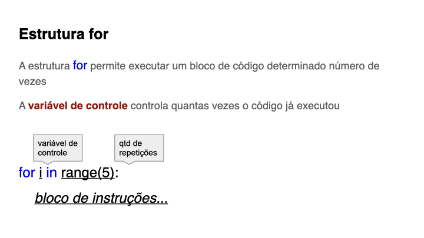

---

---

---

---

---
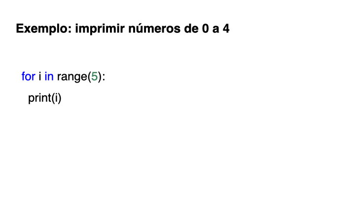

---
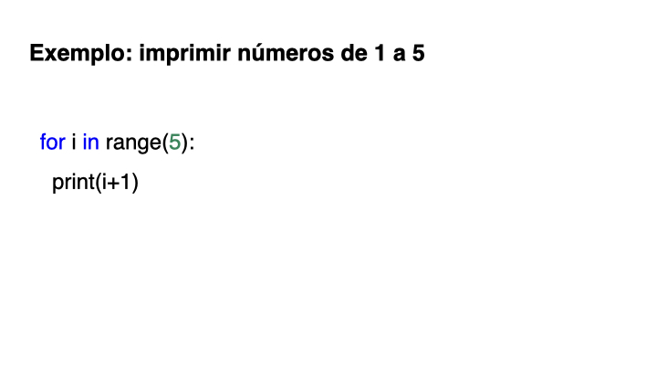

---

---

---
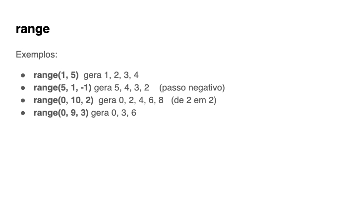

---
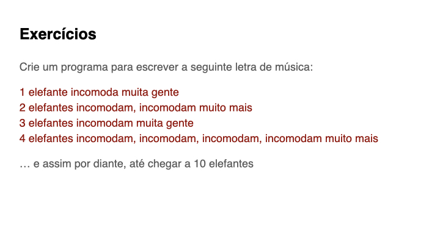

---
template: inverse
## Estrutura `while`

---

---

---
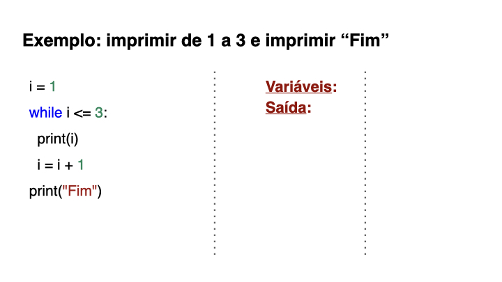

---

---
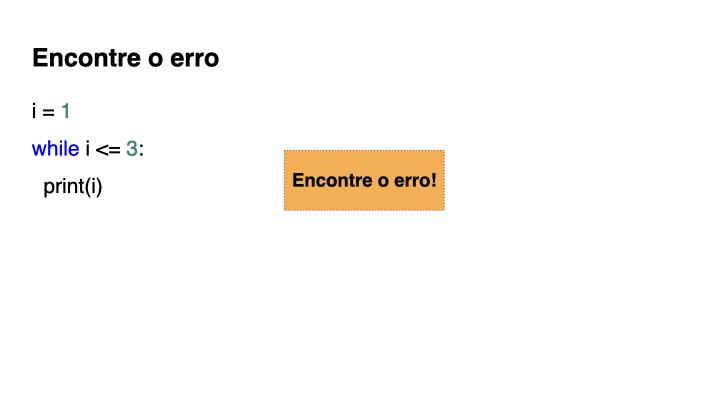

---
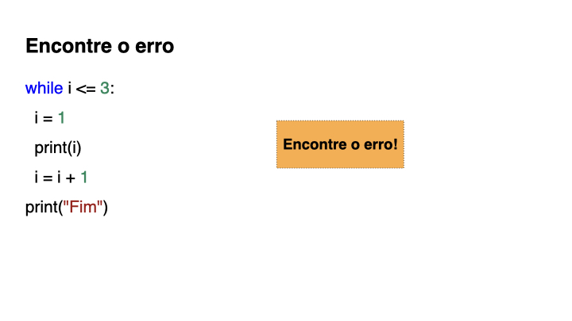

---
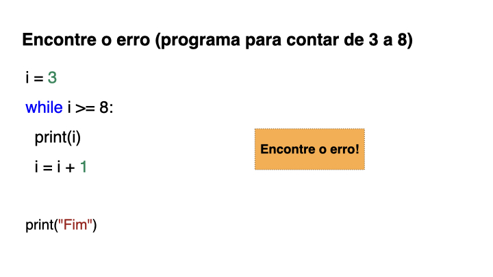

---

---

---
template: inverse
## Dicas para correção automática

---
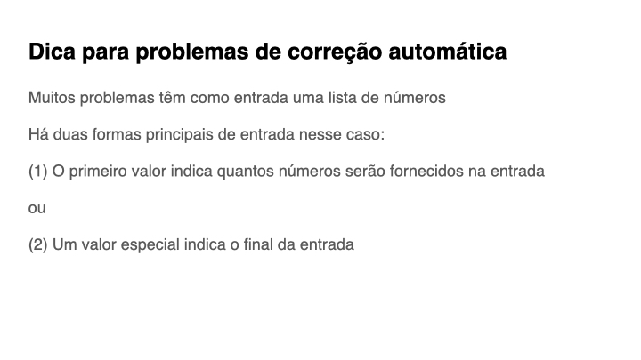

---
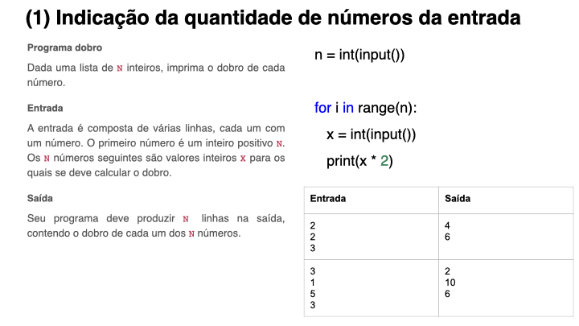

---
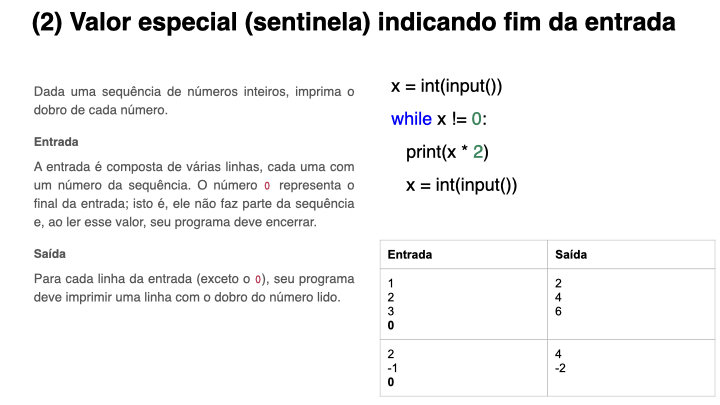

---

---
template: inverse
## Outras instruções: break e continue

---

---
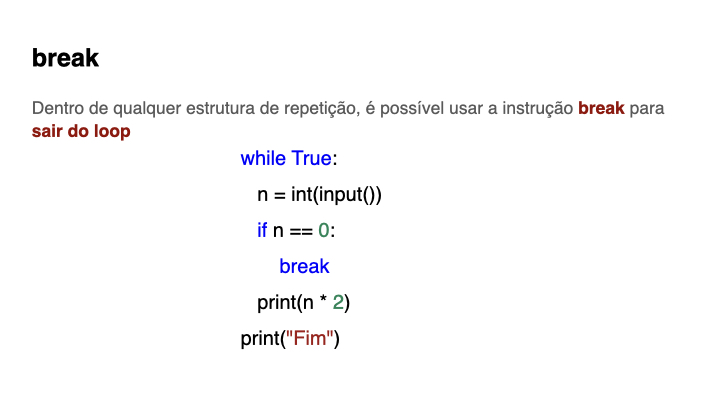

---

---
template: inverse
## Tópicos avançados

---

---
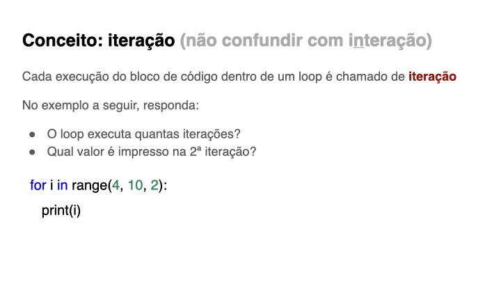

---

---

---

---
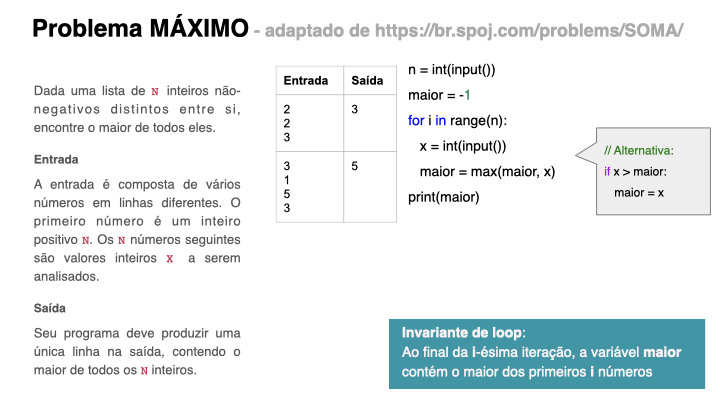

---

---

---

---
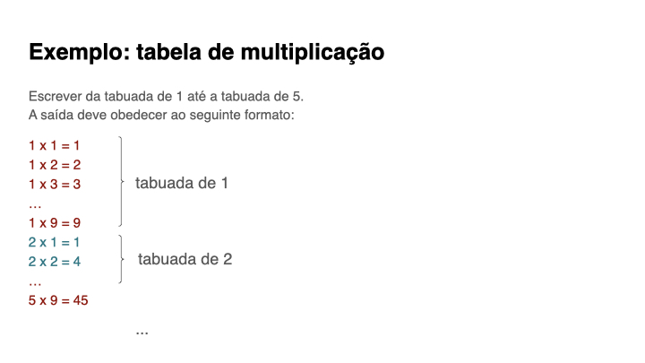

---

---
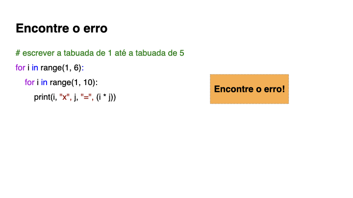

---

---

---

{:/}

