{::nomarkdown}
template: inverse

# Estruturas de Repetição 



---
template: inverse

## Estrutura `for`

---
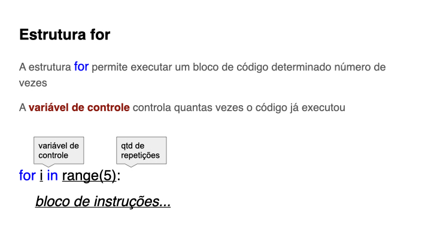

---
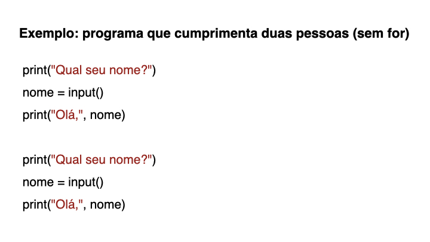

---

---
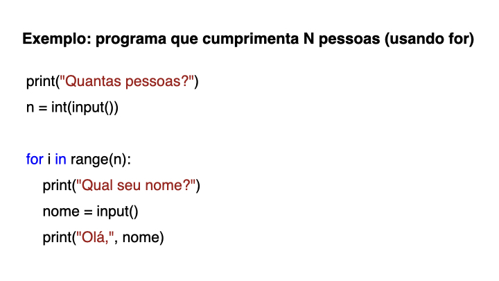

---
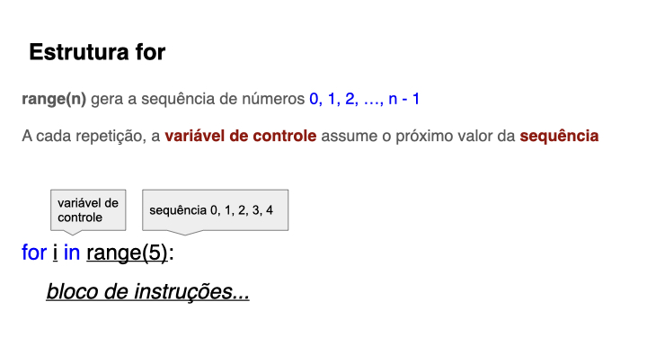

---
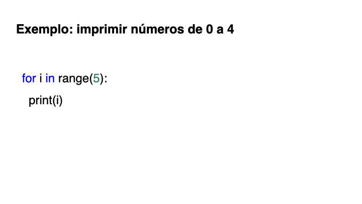

---
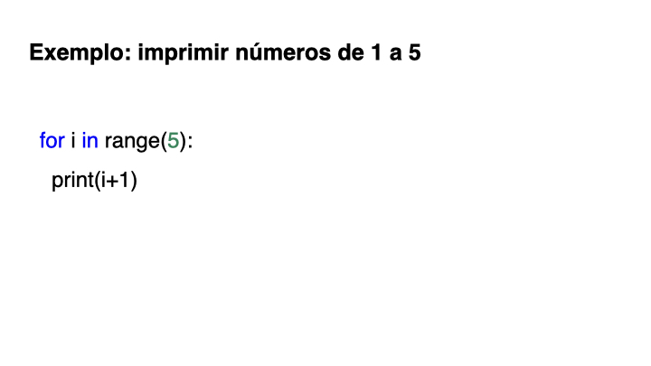

---
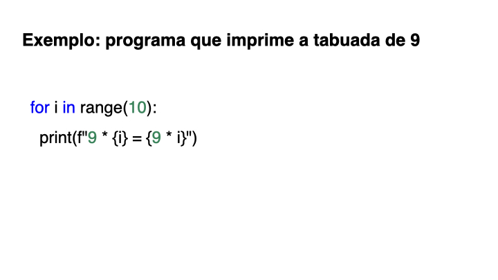

---
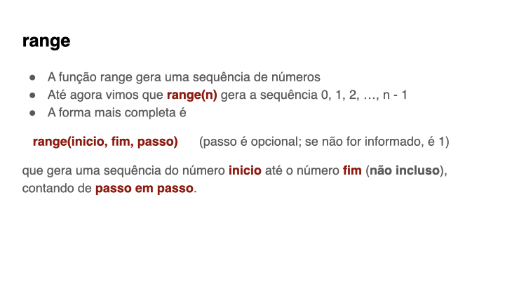

---
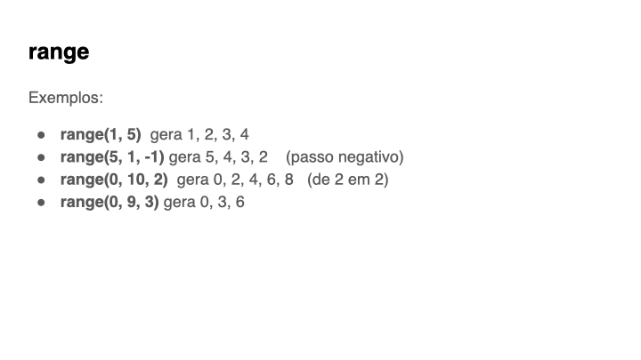

---
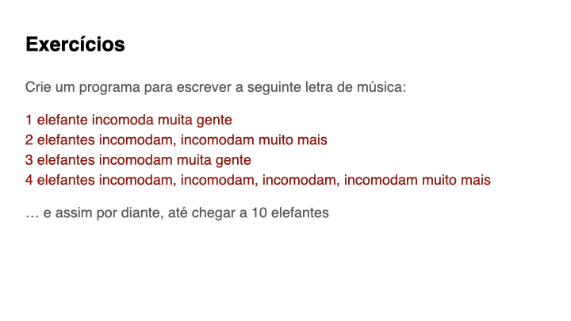

---
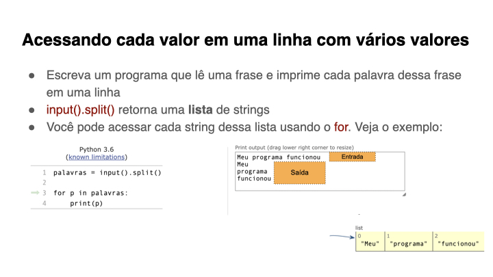

---
template: inverse

## Estruturas `for` aninhadas

---
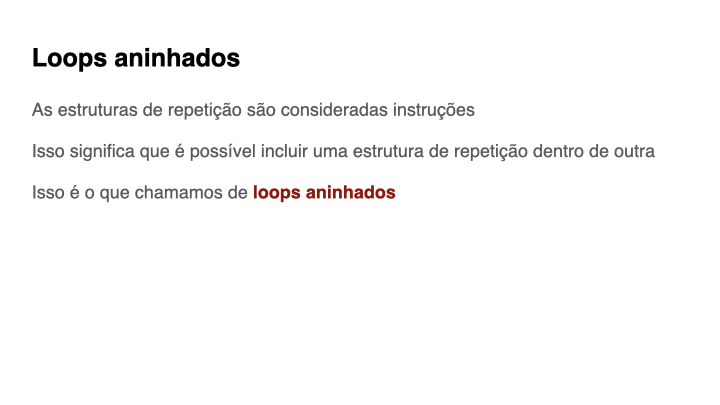

---
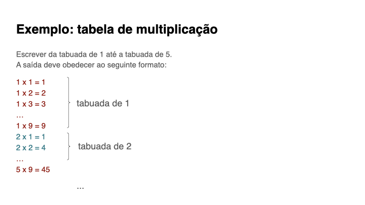

---

---
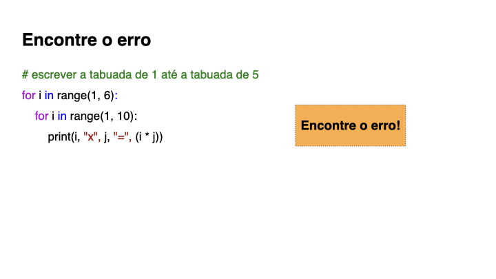

---

---
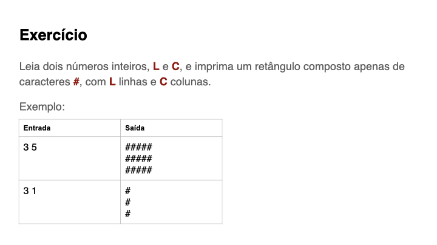

---
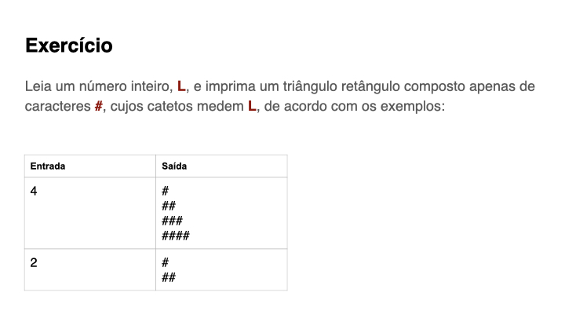

{:/}

