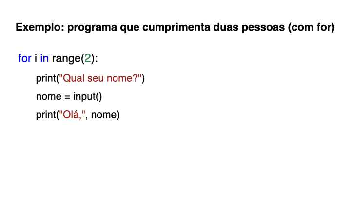
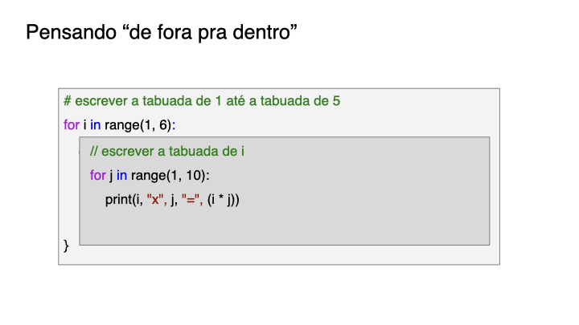

{::nomarkdown}
template: inverse

# Estruturas de Repetição 



---
template: inverse

## Estrutura `for`

---

---

---

---

---

---

---

---

---

---

---

---

---
template: inverse

## Estruturas `for` aninhadas

---

---

---

---

---

---

---

{:/}

