{::nomarkdown}
template: inverse

# Estruturas de Repetição 



---
template: inverse
## Estrutura `while`

---
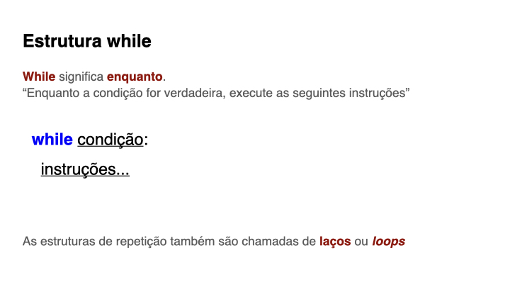

---
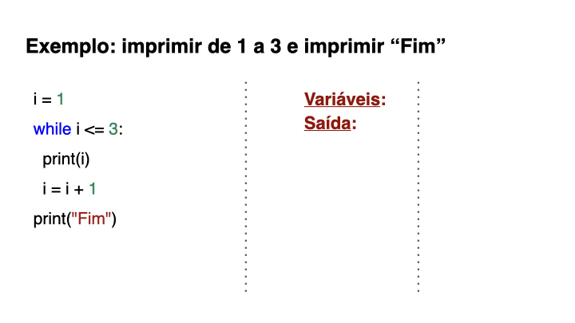

---
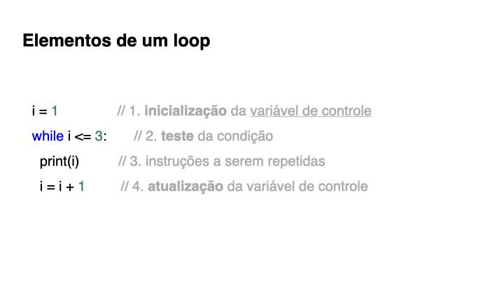

---
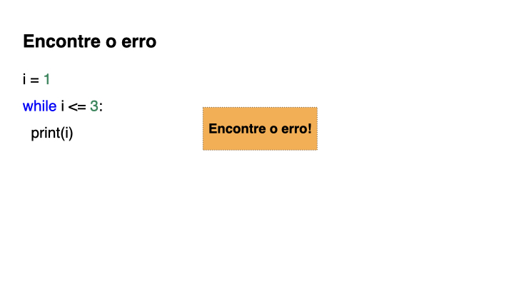

---
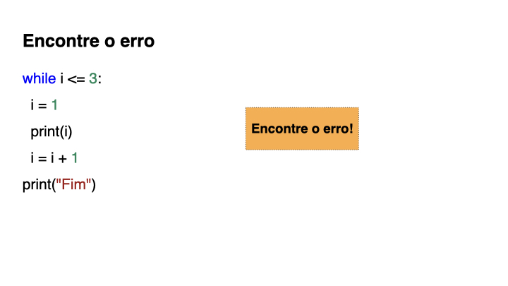

---
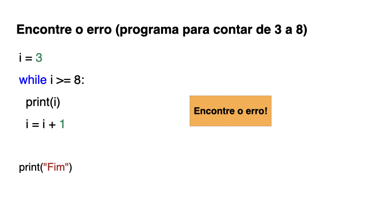

---
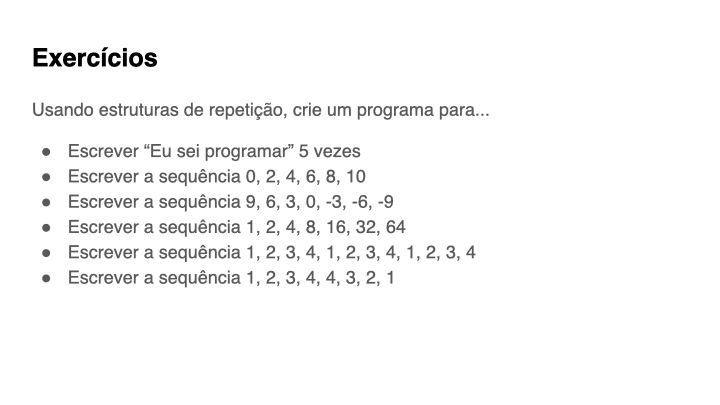

---
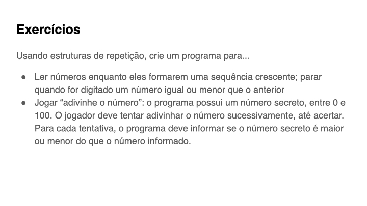

---
template: inverse
## Dicas para correção automática

---
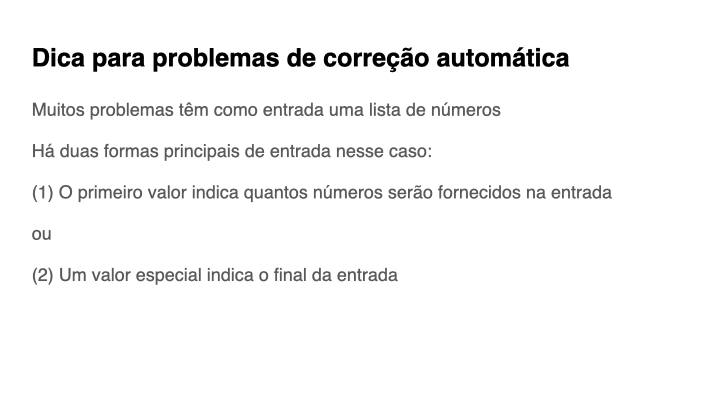

---
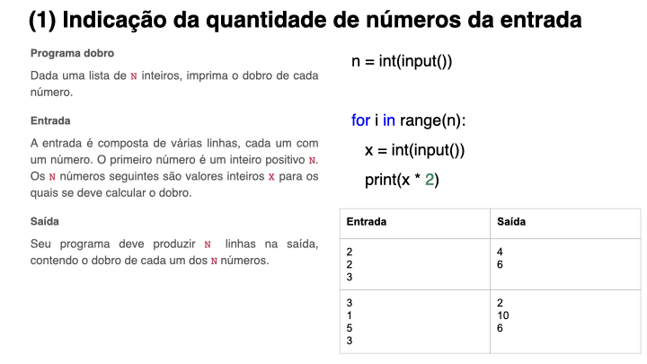

---
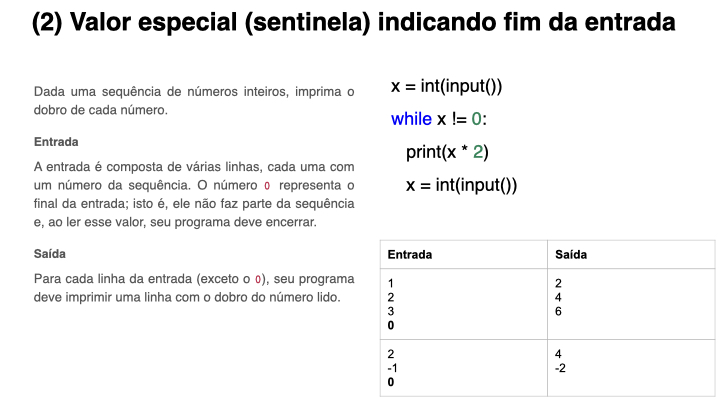

{:/}

