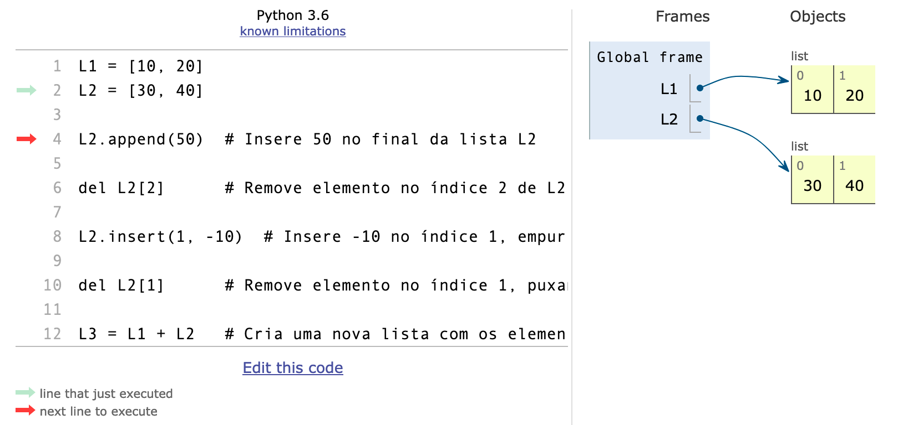
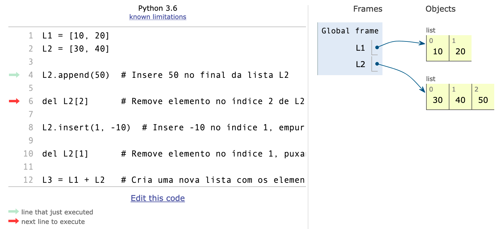
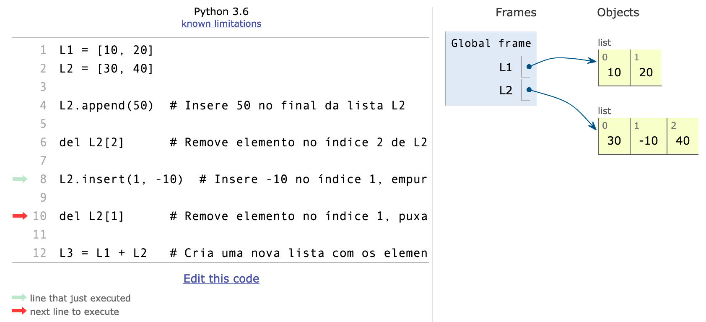
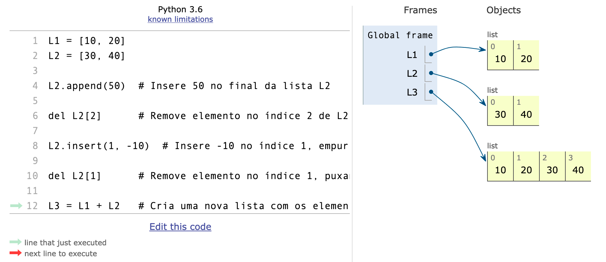

{::nomarkdown}
template: inverse

# Listas em Python



---

# Motivação

Suponha que você precisa ler 5 números e escrevê-los na ordem inversa:

```python
# Lê 5 números
a, b, c, d, e = map(float, input().split())

# Imprime na ordem inversa
print(e)
print(d)
print(c)
print(b)
print(a)
```
- E se fossem 10 mil números?

---
# Listas

A **lista** é um tipo de dados usado para armazenar coleções de dados.

- Listas podem conter 0, 1 ou mais elementos
   - **tamanho** da lista
   - Uma lista com 0 elementos é chamada de **lista vazia**
- Os elementos da lista podem ser de tipos diferentes:
   - Por exemplo, uma lista pode conter um elemento do tipo `str`, um elemento do tipo `int` e um elemento do tipo `float` 
- Elementos da lista podem ser outras listas
- É possível *adicionar* elementos ou *remover* elementos de listas.

---
# Listas (Python)

- A lista é representada entre `[` e `]`, e seus elementos são separados por vírgulas.
   - Lista vazia: []
   - Uma lista com 1 elemento: [10]
   - Uma lista com 2 elementos: [10,20]
   - Uma lista com 3 elementos de tipos diferentes: ['Maria', 10, 20.0]


---
# Inicialização com repetição
 
- Operador "\*":  usado para criar uma lista maior a partir da repetição dos elementos de uma lista menor.

```python
>>> [0] * 4
[0,0,0,0]

>>> ['a', 'b'] * 2
[ 'a', 'b', 'a', 'b']
```

---
# Tamanho da lista

Use a função `len(x)` para obter o tamanho ou o _comprimento_ de uma lista `x`.

```python
>>> lista = [2,2,2,2]
>>> print(lista)
[2, 2, 2, 2]
>>> len(lista)
4
``` 

---

# Índices: acesso a elementos da lista

- Cada elemento da lista possui um **índice** (ou **posição**):
   - o primeiro elemento possui índice 0
   - o segundo elemento possui índice 1
   - o terceiro elemento possui índice 2
e assim por diante.

- Uma lista `L` possui tamanho `len(L)` e os índices variam de 0 até `len(L)-1`

---

# Acesso a elementos da lista

Para acessar o elemento `i` de uma lista `L`, onde `i` varia de 0 até `len(L)-1`, use `L[i]`:

```python
x = ['a', 'b', 'c']
print(x[0])   # primeiro elemento da lista
print(x[1])
print(x[2])
print(x[3])   # IndexError: list index out of range
```

---

# Atribuição múltipla

Se o número de elementos de uma lista for conhecido, 
pode-se usar uma atribuição com diversas variáveis.

```python
lista = [2, 4, 6]
x, y, z = lista     # sabe-se que a lista possui 3 elementos
```

Se o número de variáveis do lado esquerdo do símbolo `=` não coincidir com 
o número de elementos da lista, o erro `ValueError` será reportado.

---

# Alteração de valor de elemento da lista

Pode-se alterar um elemento da lista realizando uma atribuição:

```python
x = ['a', 'b', 'c']  # lista original com 3 elementos
x[0] = 'Z'   # modifica o valor do primeiro elemento da lista
x[3] = 'W'   # IndexError: list assignment index out of range
```

- O elemento **x[3]** não existe.


---


# Função split() retorna uma lista de strings

- Considere a entrada `a` `b` `c` com três caracteres separados por espaço em branco.

```python
>>> letras = input().split()
a b c
>>> letras
['a', 'b', 'c']
```

---

# Conversão de map para list

O retorno da função `map()` não é uma lista, 
mas pode ser convertido para uma lista através da função `list()`:

```python
# Considere a seguinte entrada:
# 1 2 3
numeros = list(map(int, input().split()))
print(numeros)
print(numeros[0])
```

---
# Conversão de range para list

O retorno da função `range()` não é uma lista, 
mas pode ser convertido para uma lista através da função `list()`:

```python 
numeros = list(range(0, 10, 2))
numeros[0] = 99
print(numeros)
``` 

---

template: inverse
# Operações sobre Listas

Sugestão: Visualizar operações sobre listas usando o [PythonTutor](https://pythontutor.com/)

---

# append, del, insert, `+`

```python
L1 = [10, 20]
L2 = [30, 40]

L2.append(50)  # Insere 50 no final da lista L2

del L2[2]      # Remove elemento no índice 2 de L2

L2.insert(1, -10)  # Insere -10 no índice 1, empurrando os elementos para a frente

del L2[1]      # Remove elemento no índice 1, puxando os próximos para frente

L3 = L1 + L2   # Cria uma nova lista com os elementos de L1 e L2
```

---
# Após a criação de L1 e L2



---
# Após inserir 50 no final da lista L2



---
# Após inserir -10 no índice 1 de L2



---
# Após a criação de L3



---

# Tipos de operações sobre listas

Há dois tipos de operações:
- Operações que **modificam uma lista** existente
- Operações que **criam uma nova lista** a partir de listas existentes

```python
L1 = [10, 20]
L2 = [30, 40]

L1.extend(L2)  # Modifica L1, inserindo os elementos de L2 no final
print(L1)

L3 = L1 + L2   # Cria uma nova lista L3; L1 e L2 não são modificadas
print(L3)

```

---
## List comprehensions

**List comprehensions** são usadas para 
_transformar_ e _filtrar_ elementos de listas.

### Transformando elementos

```python
entrada = ["4", "8", "3"]
inteiros = [int(n) for n in entrada] # mesmo tamanho
dobro = [n * 2 for n in inteiros]    # mesmo tamanho
```

### Filtrando elementos

```python
lista = [-1, -4, 2, -3, 4]
positivos = [n for n in lista if n > 0] # tamanho igual ou menor
```

### Filtrando e transformando

```python
pares = [n * 10 for n in lista if n % 2 == 0]
```

---

# Outras operações sobre listas

Para explorar:

- clear
- extend
- reverse
- pop
- remove
...

---

template:inverse

# Algoritmos que usam listas

---

# Listas são usadas com for e while

Listas são frequentemente usadas em conjunto com estruturas de repetição, sobretudo o `for`.

```python
numeros = [5, 3, 8, 1]
for n in numeros:
   print(n)
```

---

# Imprime lista enumerada de palavras

Lê uma linha com palavras e imprime uma palavra por linha, com índice.

```python
palavras = input().split()
for i in range(len(palavras)):
   print(i + 1, '-', palavras[i])
```


---
# Imprime lista de palavras na ordem inversa

Lê uma linha com palavras e imprime palavras na ordem inversa


```python
palavras = input().split()
for i in range(len(palavras) - 1, -1, -1):
   print(palavras[i])

```

---
# Cria nova lista apenas com números pares

- Solução com `append`

```python
todos = map(int, input().split())
pares = []
for n in todos:
   if n % 2 == 0:
       pares.append(n)
print(pares)
```

---
# Cria nova lista apenas com números pares

- Solução com `list comprehension`

```python
todos = [int(x) for x in input().split()]
pares = [n for n in todos if n % 2 == 0]
print(pares)
```

{:/}


